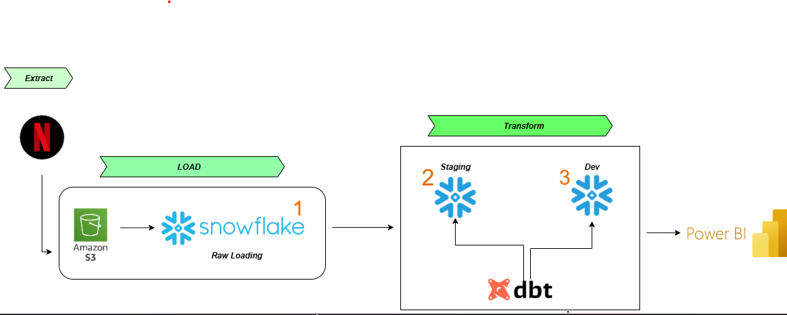

# 🎯 End-to-End Data Pipeline Project with dbt & Snowflake  

## 🔹 Project Overview  
In this project, I implemented a **modern ELT pipeline** using:  
- **Amazon S3** → as the landing zone for raw data (Extract & Load)  
- **Snowflake** → as the cloud data warehouse  
- **dbt (Data Build Tool)** → for data transformations (T in ELT)  
- **Power BI** → as the reporting & visualization layer  

This workflow follows the standard **ELT architecture** used in real-world data teams.  

---

## 🔹 Architecture Flow  
  
*Figure: End-to-End Pipeline Architecture using S3, Snowflake, dbt, and Power BI*  

1. **Extract & Load**  
   - Raw data is dumped into **Amazon S3**.  
   - Loaded directly into **Snowflake (Raw Layer)** without any transformations.  

2. **Staging Layer (Snowflake + dbt)**  
   - dbt models create **staging tables** that clean and standardize raw data.  
   - Ensures data consistency without altering raw data.  

3. **Development / Business Layer (Snowflake + dbt)**  
   - dbt transforms staging tables into **fact & dimension tables** (star schema).  
   - Business-ready tables are created for analytics.  

4. **Analytics & Reporting (Power BI)**  
   - Power BI connects to Snowflake.  
   - Business users/analysts can directly query trusted, transformed data.  

---

## 🔹 Key Learnings from this Project  
- ✅ Understood **dbt core concepts** (models, seeds, sources, materializations)  
- ✅ Learned **snapshots** to track historical changes (SCD Type 2)  
- ✅ Explored **testing in dbt** to ensure data quality (no nulls, unique values, valid relationships)  
- ✅ Practiced **documentation in dbt**, making pipelines more maintainable & shareable  
- ✅ Built **fact & dimension tables** (modularity & structured data)  
- ✅ Experienced how dbt makes collaboration easier by logging, versioning, and documenting transformations  

---

## 🔹 Why This Matters  
This project simulates how **data engineers** and **analytics engineers** work in companies:  
- **Raw data stays untouched** (always available for validation)  
- **dbt ensures clean, modular, documented transformations**  
- **Power BI delivers insights** using trusted and tested data  

---

✨ This project helped me **master the core of dbt** while seeing its role in a real-world pipeline.  
It’s a strong foundation to scale into **advanced topics** like orchestration, CI/CD for data, and performance optimization.  
